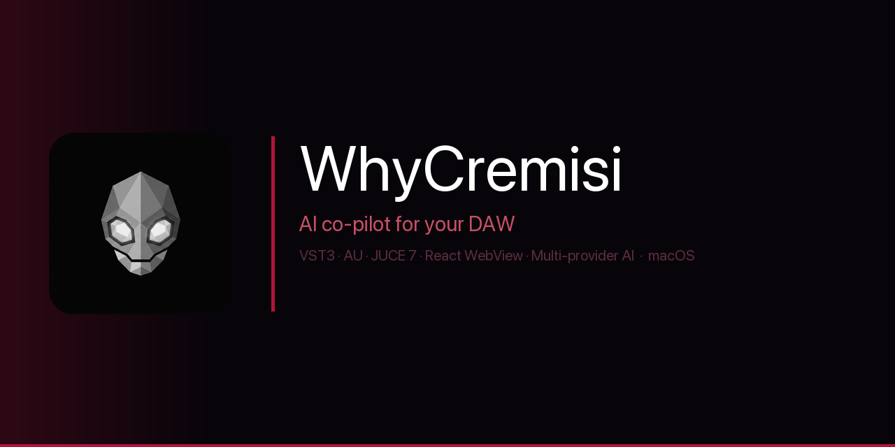
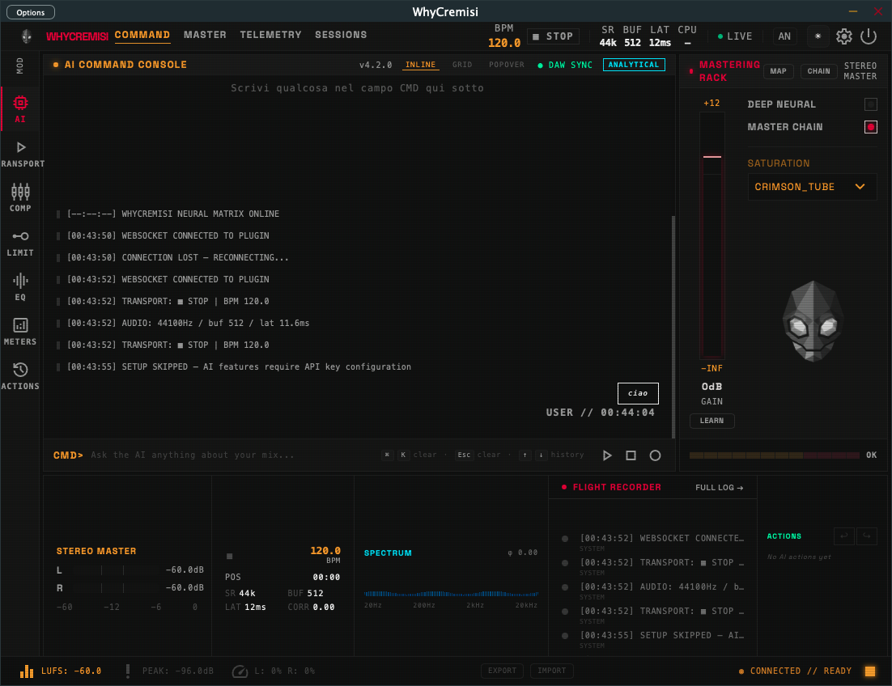

<h1 align="center">
  
  &nbsp;WhyCremisi
</h1>

<p align="center">
  <strong>The AI that lives inside your DAW — controls transports, tracks, and every knob of every plugin — without knowing them in advance.</strong>
</p>

<p align="center">
  
  
  
  
  
</p>

<p align="center">
  
  
  
  
  
  
  
</p>

<p align="center">
  <a href="https://officialwhyed.github.io/WhyCremisi"><strong>🌐 Website</strong></a>
  &nbsp;·&nbsp;
  <a href="https://github.com/OfficialWhyEd/WhyCremisi/stargazers">⭐ Star this repo</a>
  &nbsp;·&nbsp;
  <a href="https://github.com/OfficialWhyEd/WhyCremisi/issues">🐛 Report a bug</a>
  &nbsp;·&nbsp;
  <a href="https://discord.gg/cQQckfnN">💬 Discord</a>
  &nbsp;·&nbsp;
  <a href="https://instagram.com/whyed.music">📸 Instagram</a>
  &nbsp;·&nbsp;
  <a href="https://x.com/OfficialWhyEd">𝕏 Follow</a>
</p>

<br/>

---

<h2 align="center">🎹 &nbsp; If you make music, this is for you</h2>

<p align="center">You don't need to know C++. You don't need to code. You don't need to map any preset.<br/>
You just need a DAW, a microphone for your ideas, and a question to type.</p>

<table align="center">
<tr>
<td align="center" width="33%">

**① Load the plugin**<br/>
Drag WhyCremisi onto your master channel. It auto-scans every plugin in your session.

</td>
<td align="center" width="33%">

**② Just talk to it**<br/>
Type naturally — *"The low end is muddy"* · *"Start the recording"* · *"What should I fix here?"*

</td>
<td align="center" width="33%">

**③ It talks back**<br/>
The AI moves knobs, explains what it did, and drops interactive suggestion boxes right in the UI.

</td>
</tr>
</table>

<p align="center">Works offline with <a href="https://ollama.ai">Ollama</a> — no API key, no subscription, no latency.</p>

---

<p align="center">
  
</p>

<br/>

> **WhyCremisi installs on your master channel.** From there, it takes full control of your DAW: it can play/stop/record, mute tracks, adjust volumes, and scan every parameter of every plugin in the session — Serum, FabFilter, Valhalla, anything. It exposes everything to an AI that can read, write and automate it all in real time. No preset mapping. No plugin SDK. No prior knowledge of the plugin. Just index-based VST3 parameter scanning, and an AI that learns what each knob does on the fly.

---

<details>
<summary><strong>Table of Contents</strong></summary>

- [The philosophy](#the-philosophy)
- [There are no limits to what you can ask](#there-are-no-limits-to-what-you-can-ask)
- [It's a conversation, not a command line](#its-a-conversation-not-a-command-line)
- [Smart suggestion widgets](#smart-suggestion-widgets)
- [Why this is different](#why-this-is-different)
- [The most advanced plugins in the world](#the-most-advanced-plugins-in-the-world-all-of-them-right-now)
- [A full AI agent inside your DAW](#a-full-ai-agent-inside-your-daw)
- [How it works](#how-it-works)
- [Three phases of intelligence](#three-phases-of-intelligence)
- [The wire protocol](#the-wire-protocol)
- [Session memory](#session-memory--how-nothing-gets-lost)
- [AI providers](#ai-providers)
- [BotFace](#botface--personality-built-in)
- [Features](#features)
- [Plugin Dictionary](#plugin-dictionary-target-list)
- [Compatibility](#compatibility--from-old-sessions-to-the-newest-sdk)
- [Quick start](#quick-start)
- [Project structure](#project-structure)
- [Roadmap](#roadmap)
- [Contributing](#contributing)

</details>

---

## The philosophy

WhyCremisi was built around one idea: **creativity has no limits, and neither should the tool.**

Most audio software asks you to learn its language — menu structures, preset names, parameter ranges. WhyCremisi flips this. You speak in the language of music and emotion. The software figures out the rest.

You shouldn't need to know that "filter cutoff" is parameter index 0047 in Serum. You should be able to say *"make it darker"* and have it happen. You shouldn't need to google Pretolesi's mastering chain — you should be able to say *"master this like Pretolesi"* and watch it apply, knob by knob, in your actual session.

This is the approach:

- **Ask anything.** Mix like Chris Lord-Alge. Master like Stefano Pretolesi. Check controfasi. Rebuild your low end. There are no supported commands — there is only what you can describe.
- **Every plugin. Including the ones released yesterday.** Not just Serum and FabFilter — native DAW plugins, Serum 2, Pro-Q 4, iZotope, Waves, Native Instruments, anything. Because it reads VST3 parameter indices at runtime, it never needs an update to support a new plugin. Load it, and it's mapped.
- **A living encyclopedia of professional plugins.** On top of raw index scanning, WhyCremisi ships with a curated dictionary of the most-used modern plugins — human-readable names, ranges, interdependencies, professional usage patterns. It grows over time, and you can add your own entries.
- **It creates, not just edits.** WhyCremisi has full access to the piano roll. It can write complete songs from scratch — verse, chorus, bridge, every instrument, every note — directly into your DAW's timeline. It can also rewrite specific bars, add layers, adjust voicings, and iterate on its own compositions when you push back. It's not limited to tweaking what already exists. It can build entire tracks from nothing.
- **It remembers everything.** Every parameter touch, every decision, every session. Not just this session — every session. It knows your history and learns your taste.
- **It has a personality.** WhyCremisi isn't a search bar. It's a collaborator. It thinks, it replies, it explains its reasoning, it makes suggestions. It pushes back when something doesn't make sense. It has a face that shows you how it feels.
- **It's always in the room with you.** Not an external app, not a chatbot tab. It lives inside your DAW, on the master channel, watching and listening to everything that happens in the session.

The goal is to make the gap between what you hear in your head and what comes out of the speakers as small as possible — using nothing but natural language and an AI that actually understands audio.

---

<p align="center">
  
</p>

---

## There are no limits to what you can ask

WhyCremisi doesn't have a list of supported commands. It has a brain, a memory, and a personality. You can ask it anything a world-class audio engineer would know — and it will try to make it happen, parameter by parameter, in your actual session.

**Mixing & mastering:**
```
"Mix this track the way Chris Lord-Alge would"
```
→ Aggressive parallel compression on the drums, mid-forward guitars, punchy low end — CLA's signature applied to your session's plugins.

```
"Master this like Stefano Pretolesi"
```
→ Clean limiting, controlled low end, that Italian hi-fi warmth. Applied to whatever's on your master chain.

**Phase & analysis:**
```
"Check the phases across all tracks — fix anything that's cancelling"
```
→ WhyCremisi analyzes polarity relationships between plugins and tracks. Flags and corrects phase cancellations before they kill your low end.

**DAW control:**
```
"Start playback" · "Mute the kick and bass" · "Drop the vocal by 3dB"
```
→ Native DAW commands: transport, faders, mute, solo — no clicking.

**Session memory:**
```
"What did we do in the last 3 sessions on this track?"
```
→ Queries `memory.json` and `events.jsonl` across sessions. Full recall of every parameter touch, every AI decision, everything you said yes or no to.

```
"Remember: I always want the kick at -6dBFS peak. Apply this to every session."
```
→ Written to long-term memory. From now on, it's a rule WhyCremisi enforces automatically.

**Native plugins:**
```
"Use Logic's built-in compressor on the drums and push the attack a bit"
```
→ Stock EQ, bundled instruments, built-in effects — all mapped, all controllable exactly like third-party plugins.

**Composition:**
```
"Write me a full song — verse, pre-chorus, chorus, bridge. Dark pop, 128 BPM, key of A minor."
```
→ WhyCremisi opens the piano roll and composes the entire arrangement. Every part. Every instrument. Every note velocity and length. A complete song structure, written directly into your DAW's timeline — without you touching a single key.

```
"Take what you just wrote and make the chorus more emotional — add a string layer and open up the harmony"
```
→ Goes back into the piano roll, adds a new MIDI track, writes the string part, adjusts the chord voicings in the existing regions. It remembers exactly what it wrote and why.

```
"The verse melody is too predictable. Rewrite bars 5 to 8 and add some unexpected intervals"
```
→ Selects the specific region, rewrites only those bars, keeps the rest intact.

The creativity has no ceiling. If a human composer, engineer or producer could describe the move in words, WhyCremisi can attempt it — in knobs, in regions, in melodies, in the piano roll, in the full arrangement.

---

## It's a conversation, not a command line

WhyCremisi is not a search bar where you type exact commands. You talk to it the way you'd talk to a collaborator in the studio.

```
You:  "Something feels off in the high end, not sure what"
AI:   "The FabFilter Q3 has a +4.2dB shelf at 10kHz that might be too aggressive
       for this mix. I also see Serum's oscillator brightness is at 78% — that's
       quite high. Want me to pull both down a bit and see how it feels?"
You:  "Yeah try it"
AI:   [moves both parameters] "Done. The shelf is now +1.8dB and Serum brightness
       is at 55%. How does that sit?"
```

The AI sees your full session — current values, what you changed recently, what's loaded, what's playing. It reasons from that context, not from a manual.

---

## Smart suggestion widgets

As the conversation evolves, WhyCremisi creates **interactive parameter widgets** directly in the plugin UI — no need to hunt for knobs across multiple plugin windows.

```
┌─────────────────────────────────────┐
│  Suggested tweaks                   │
│                                     │
│  FabFilter Q3 · High Shelf          │
│  ████████░░░░  +1.8 dB   [Apply]   │
│                                     │
│  Serum · Osc A Brightness           │
│  █████████░░░  55%        [Apply]   │
│                                     │
│  Valhalla · Decay Time              │
│  ████░░░░░░░░  1.2s       [Apply]   │
└─────────────────────────────────────┘
```

The AI decides which parameters are worth surfacing based on your conversation. Widgets appear live, update as values change, and disappear when they're no longer relevant. You can apply each suggestion individually or tell the AI to go ahead with all of them.

Every widget interaction is logged to the session, so the AI knows what you accepted and what you ignored — and learns your preferences over time.

---

## Why this is different

Every other "AI for music production" tool is either a standalone app disconnected from your session, or a chatbot that generates MIDI. WhyCremisi is a **plugin** — it loads in the same DAW process as your other plugins, sits on the master channel, and has native access to the VST3 parameter graph of the entire session.

| | WhyCremisi | Standalone AI tools | Manual workflow |
|---|---|---|---|
| Lives inside the DAW | ✅ VST3/AU plugin | ❌ External app | — |
| Controls transport (play/stop/record) | ✅ Native DAW commands | ❌ | ❌ Manual |
| Controls track volume, mute, solo | ✅ Real-time fader control | ❌ | ❌ Manual |
| Accesses any plugin's parameters | ✅ Universal bridge | ❌ Hardcoded presets | ❌ One by one |
| No preset mapping needed | ✅ Auto-discovery | ❌ Plugin-specific | — |
| Writes MIDI / creates regions | ✅ Piano roll access | ❌ | ❌ Manual |
| React UI inside the plugin | ✅ WebView | ❌ | — |
| Knows the session history | ✅ Flight Recorder | ❌ | ❌ |
| Streaming AI responses | ✅ Chunk-by-chunk | ❌ | — |
| Run offline | ✅ Ollama support | ❌ | — |
| Works with any DAW | ✅ JUCE/VST3/AU | ⚠️ Limited | ✅ |

---

## The most advanced plugins in the world. All of them. Right now.

FabFilter Pro-Q 4 just dropped. Serum 2 is out. iZotope Ozone 11, Neutron 5, RX 11. Native Instruments Kontakt 8. Waves' entire catalog. Plugin Alliance, Slate Digital, UAD — anything.

WhyCremisi doesn't need a software update to support them. It doesn't need a new preset file or a mapping patch. The moment you load any plugin in your DAW, WhyCremisi reads every parameter it exposes through the VST3 interface — index by index, in real time. A plugin released today works the same as one released ten years ago.

**And on top of that: a living encyclopedia.**

The Plugin Dictionary is a curated, human-readable knowledge base of the most-used modern plugins — their parameter names, ranges, behaviors, interdependencies, the way professionals use them. It ships with entries for the industry standards and it grows over time:

- You can add your own entries for plugins you use
- The community contributes mappings via pull requests
- The AI uses the dictionary to speak intelligently about plugins it already knows, and falls back to raw index scanning for everything else

The dictionary is not a limitation — it's an accelerant. WhyCremisi works with every plugin. It just works *smarter* with the ones in the dictionary.

---

## A full AI agent. Inside your DAW.

This is the part that shouldn't be possible.

WhyCremisi doesn't just call an LLM and paste the response. It runs a **complete AI agent** with access to every tool a modern code agent has — from inside a plugin slot on your master channel.

| Tool | What it can do inside WhyCremisi |
|---|---|
| **Web search** | Look up mixing techniques, find reference tracks, research what a specific plugin parameter does |
| **Bash execution** | Run shell scripts, process audio files, call external tools, automate anything on your system |
| **Code generation** | Write and run code — generate Max for Live devices, MIDI scripts, automation data |
| **File system** | Read and write project files, export session reports, load stems, organize your library |
| **DAW control** | Play, stop, record, mute, automate, create regions, write MIDI — full native control |
| **Plugin parameters** | Read and write any knob on any plugin, any DAW, in real time |
| **Session memory** | JSONL log + cross-session memory.json — full recall of everything |

Imagine asking your DAW: *"Search for how Chris Lord-Alge sets up his SSL bus compressor, then apply those settings to my master chain."* WhyCremisi searches the web, reads the result, finds the closest parameters in your loaded plugins, and applies them. Without leaving the DAW. Without switching tabs. Without touching a single knob.

This is not a plugin that wraps an AI. This is an AI agent that happens to live inside a plugin.

---

## What makes this technically insane

Most DAW plugins are islands. They process audio and expose a UI — that's it. WhyCremisi breaks out of that model in three ways that shouldn't be possible from a single plugin slot:

**1. It reads every other plugin's parameters without their SDK.**
VST3 exposes parameters as numbered indices. WhyCremisi iterates them all at load time. It doesn't need to know what Serum is. It finds every knob Serum exposes and maps them. Same for any plugin you throw at it.

**2. It runs a full React app inside the plugin window.**
Most plugin UIs are drawn with OpenGL or platform-native widgets. WhyCremisi hosts a real React app inside a JUCE WebView, connected to the plugin backend via a WebSocket running at `localhost:8080`. The UI is hot-reloadable during development.

**3. The AI sees your entire session history, not just the current state.**
Every parameter change, transport event, OSC message and AI interaction is appended to a JSONL log in real time. When you ask the AI something, it gets the last N minutes of session context. It knows what you changed, when, and in what order.

---

## How it works

WhyCremisi doesn't need to know what a plugin is. VST3 exposes every parameter as a numbered index. WhyCremisi reads them all. The entire communication stack runs inside the DAW process — no external app, no network roundtrip.

```
┌─────────────────────────────────────────────────────────┐
│                     Your DAW session                    │
│                                                         │
│  [Serum]  [FabFilter Q4]  [Valhalla]  [OTT]  ...      │
│     │           │               │        │              │
│     └───────────┴───────────────┴────────┘              │
│                         │   VST3 parameter graph        │
│              ┌──────────▼──────────┐                    │
│              │    WhyCremisi       │  ← master channel  │
│              │                     │                    │
│              │  AiEngine           │  Ollama / Groq /   │
│              │  SessionManager     │  Gemini / Claude   │
│              │  OscBridge          │  OpenAI / OpenRouter│
│              └──────┬──────────────┘                    │
└─────────────────────┼───────────────────────────────────┘
                      │
        ┌─────────────┴──────────────┐
        │                            │
   OSC UDP :9000               WebSocket :8080
   (DAW → plugin)         (plugin ↔ React UI)
        │                            │
   OSC UDP :9001            WhyCremisiBridge.js
   (plugin → DAW)          (singleton, auto-reconnect)
                                     │
                              React UI (WebView)
                           transport · tracks · widgets
                           useWhyCremisi() hook
```

**The 33ms broadcast loop** — a JUCE `Timer` fires every 33ms (~30fps), pushing DAW state (transport, meter L/R/peak) to every connected WebSocket client. React stays in sync with the DAW in real time without polling.

**The Flight Recorder** — every event in the session is appended to a JSONL file with millisecond timestamps. Parameter changes, transport events, AI prompts and responses, OSC messages, errors — all of it. The AI sees not just the current state but everything that happened since you pressed play.

---

## Three phases of intelligence

| Phase | What it does | Status |
|-------|-------------|--------|
| **① Universal Bridge** | Scans and maps all VST3 parameters by index across every loaded plugin. Read + write in real time. | ✅ Live |
| **② Plugin Dictionary** | Semantic layer that maps index numbers to human-readable names for the 10 most-used plugins in the world. "Filter cutoff" instead of "param_0047". | 🔧 Building |
| **③ Auto-Discovery** | AI infers what unknown parameters do by observing their effect on audio. Learns any plugin without a dictionary entry. | 🔮 Roadmap |

Phase ① alone is already useful. You can ask the AI to move a parameter and it will find it. Phases ② and ③ make it fluent.

---

<details>
<summary><strong>The wire protocol — full message reference</strong></summary>

<br/>

Every message on the WebSocket is a JSON object:

```json
{ "type": "ai.prompt", "id": "uuid-v4", "timestamp": 1718123456789, "payload": { ... } }
```

**DAW → UI** events the plugin broadcasts:

| Message type | What it carries |
|---|---|
| `daw.transport` | isPlaying, isRecording, BPM, positionSeconds |
| `daw.track` | trackId, name, volumeDb, pan, muted, soloed |
| `daw.meter` | trackId, leftDb, rightDb, peakLeftDb, peakRightDb |
| `ai.response` | requestId, content, provider, isComplete |
| `ai.stream` | requestId, chunk, isDone — for streaming responses |
| `ui.widget.create` | widgetId, widgetType, title, config |
| `ui.widget.update` | widgetId + updated values |
| `plugin.error` | code, message, severity |

**UI → DAW** commands the React side can send:

| Message type | Effect |
|---|---|
| `daw.command` | play, stop, record, setVolume, etc. |
| `daw.request` | request track list, session state |
| `ai.prompt` | dispatch a prompt to the AI provider |
| `ui.widget.create/remove` | manage dynamic UI widgets |
| `osc.send` | forward a raw OSC message to the DAW |
| `config.get / config.set` | read/write plugin config at runtime |

</details>

---

<details>
<summary><strong>Session memory — full storage layout</strong></summary>

<br/>

```
~/Library/Application Support/WhyCremisi/
  sessions/
    20240615_142301/
      header.json      ← session metadata, written once at start
      events.jsonl     ← one JSON object per line, append-only
      summary.json     ← event counts per type, written at end
  current.json         ← always-fresh live snapshot of active session
  memory.json          ← long-term knowledge base, updated across sessions
```

`events.jsonl` is the core: append-only, zero-overhead, reconstructable. Every `logOscEvent`, `logTransport`, `logParameter`, `logAiPrompt`, `logAiResponse`, `logError` call adds one line. The rate-limiter keeps meter ticks to 1 entry per 500ms and position ticks to 1 per second — so the log stays usable at high sample rates.

`memory.json` accumulates knowledge across sessions. The AI doesn't start from zero each time.

</details>

---

## AI providers

| Provider | Default | Notes |
|---|---|---|
| **Ollama** | ✅ yes (llama3.2) | Runs at `localhost:11434`, fully offline |
| **Groq** | — | Fast inference, free tier available |
| **Gemini** | — | Google, flash and pro models |
| **Anthropic** | — | Claude 3 family |
| **OpenAI** | — | GPT-4o and variants |
| **OpenRouter** | — | Single key, any model |

Config: `temperature 0.7`, `maxTokens 2048`, `timeout 30s`. All providers share the same `sendPromptAsync()` interface — swap with one config change.

---

## BotFace — personality built in

WhyCremisi isn't a toolbar with an LLM behind it. It has a face, emotional states, and a voice. BotFace is the animated SVG mascot living inside the plugin UI — and it reacts to everything happening in the session in real time.

| What's happening | BotFace state |
|---|---|
| You sent a prompt | `thinking` — processing your request |
| AI is streaming a response | `typing` — word by word |
| Response complete | `success` → back to `idle` after 2s |
| Something went wrong | `error` → recovers to `idle` after 3s |
| Waiting for you | `idle` |

9 emotional states total, animated with framer-motion. It's not decorative — it's a live status indicator that makes the AI feel present, not just functional. When WhyCremisi is thinking about your mix, you see it think. When it's done, it settles. It feels alive because it is, in the only way software can be.

---

## Features

- **Universal parameter bridge** — reads and writes any VST3 parameter by index, across all plugins simultaneously
- **Piano roll access** — writes MIDI regions, melodies, chord progressions, full song arrangements directly into the DAW timeline
- **Flight Recorder** — append-only JSONL session log + cross-session `memory.json`, injected as context into every AI prompt
- **Streaming AI responses** — chunk-by-chunk `ai.stream` messages, BotFace animates during generation
- **BotFace mascot** — animated SVG mascot with 9 emotional states, state machine driven by WebSocket message types
- **React WebView UI** — full React app rendered inside a JUCE WebView, `useWhyCremisi()` hook for clean integration
- **WhyCremisiBridge.js** — WebSocket singleton with auto-reconnect (10 attempts, 2s interval), pending request map, typed event emitter
- **33ms broadcast loop** — JUCE Timer pushes transport + meter to React at ~30fps
- **Dynamic widget system** — C++ broadcasts `ui.widget.create/update/remove`, React renders them live
- **Multi-provider AI** — Ollama (offline default) + Groq + Gemini + Claude + OpenAI + OpenRouter
- **14 automated tests** — CI-ready, build is stable
- **VST3 + AU + Standalone** — one codebase, three build targets

---

## Plugin Dictionary target list

The plugins that cover ~90% of real-world sessions. Every plugin works via index scanning on day zero — the dictionary adds semantic understanding on top:

| Plugin | Category | Status |
|--------|----------|--------|
| **Serum / Serum 2** | Synthesizer | 🔧 Mapping |
| **Vital** | Synthesizer | 🔧 Mapping |
| **Massive X** | Synthesizer | 📋 Queued |
| **FabFilter Pro-Q 4** | EQ | 🔧 Mapping |
| **FabFilter Pro-C 2** | Compressor | 📋 Queued |
| **OTT** | Multiband | ✅ Complete |
| **iZotope Ozone 11** | Mastering | 📋 Queued |
| **Valhalla VintageVerb** | Reverb | 📋 Queued |
| **Valhalla Delay** | Delay | 📋 Queued |
| **Waves SSL E-Channel** | Channel strip | 📋 Queued |

---

## Compatibility — from old sessions to the newest SDK

| Environment | Support |
|---|---|
| Modern DAW (Logic 11, Ableton 12, Cubase 13+) | ✅ Full — SDK extensions, extended context |
| Older DAW (Logic 10.7, Ableton 11, Cubase 12) | ✅ Full — core parameter bridge, all features |
| Legacy sessions / older plugin versions | ✅ Read + write still works via index scanning |
| AU (macOS only) | ✅ Same bridge, different plugin format |
| Standalone mode | ✅ No DAW needed, bridge runs independently |

The VST3 SDK's extension architecture (note expression, MIDI 2.0, MPE, inter-plugin communication) is supported where available and degrades gracefully where it isn't. The core mechanism — VST3 index-based parameter scanning — has been stable since VST3's initial release.

---

## Quick start

**Prerequisites:** CMake ≥ 3.22 · Xcode Command Line Tools · [JUCE 7](https://juce.com/get-juce/)

```bash
git clone https://github.com/OfficialWhyEd/WhyCremisi
cd WhyCremisi

# Build
cmake -B build -DJUCE_ROOT=/path/to/JUCE
cmake --build build --config Release

# Install VST3
cp -r build/WhyCremisi_artefacts/VST3/WhyCremisi.vst3 \
      ~/Library/Audio/Plug-Ins/VST3/

# Configure AI provider
cp config.example.json config.json
# → set your preferred provider + key in config.json
```

Load WhyCremisi on the **master channel** in your DAW. Open the plugin UI. The bridge starts automatically — OSC on `:9000`, WebSocket on `:8080`, React connects and sends `plugin.init`.

For **offline use**: install [Ollama](https://ollama.ai), run `ollama pull llama3.2`. No API key needed.

---

<details>
<summary><strong>Project structure</strong></summary>

<br/>

```
WhyCremisi/
├── src/
│   ├── core/
│   │   ├── PluginProcessor.cpp    # VST3 host + universal parameter scanner
│   │   ├── PluginEditor.cpp       # JUCE WebView host
│   │   ├── SessionManager.cpp     # JSONL event log + cross-session memory.json
│   │   └── tests/                 # 14 automated tests
│   ├── ai/
│   │   └── AiEngine.cpp           # 6 providers, sync + async, streaming
│   └── bridge/
│       ├── OscBridge.cpp          # 33ms timer, widget broadcasts, message dispatch
│       ├── OscHandler.cpp         # UDP OSC receiver (:9000 in, :9001 out)
│       └── WebSocketServer.cpp    # TCP WebSocket server (:8080)
├── webview-ui/                    # React app (UI, BotFace, panels)
│   └── src/
│       ├── whycremisi-bridge.js   # WebSocket singleton + useWhyCremisi() hook
│       ├── BotFace.jsx            # Animated mascot — 9 states, framer-motion
│       ├── SessionPanel.jsx       # Flight recorder view
│       └── WidgetSystem.jsx       # Dynamic plugin parameter widgets
├── docs/                          # GitHub Pages landing page
│   └── index.html                 # → officialwhyed.github.io/WhyCremisi
└── Research/                      # Logo, design system, visual docs
```

</details>

---

## Roadmap

- [ ] Plugin dictionary for top 10 plugins
- [ ] Auto-discovery via audio analysis
- [ ] Parameter automation curves generated by AI
- [ ] Session summary export (what the AI did, and why)
- [ ] Windows support (JUCE is cross-platform, bridge needs porting)
- [ ] Plugin state presets saved by AI ("my warm master", "my hard-clipped drums")

---

## Contributing

This is a one-person project so far. PRs, issues and discussions are very welcome — especially for:

- **Plugin dictionary entries** — if you've mapped parameters for any DAW plugin, open a PR
- **Provider implementations** — new AI providers follow the same interface as the existing 6
- **DAW compatibility testing** — tested on Ableton and Logic, reports for other DAWs appreciated
- **Windows port** — the JUCE layer is cross-platform, the bridge needs porting

If you're working on something larger, open an issue first so we can align.

---

## Spread the word

If WhyCremisi made you go "wait, this is actually insane" — that's the right reaction.

1. **⭐ Star the repo** — it helps with discoverability
2. **[Join the Discord](https://discord.gg/cQQckfnN)** — live sessions, dev updates, direct feedback
3. **[Follow on Instagram](https://instagram.com/whyed.music)** — behind the scenes and demos
4. **Share on Twitter/X** with what you think is the craziest part
5. **Post in your DAW's community** — r/ableton, r/edmproduction, r/audioengineering, KVR Audio
6. **Show it to your music producer friends** — they will not believe it's a plugin

---

## Star history

[](https://star-history.com/#OfficialWhyEd/WhyCremisi&Date)

---

<p align="center">
  <br/>
  Built by <a href="https://github.com/OfficialWhyEd">@whyed</a>
  &nbsp;·&nbsp; macOS · JUCE 7 · MIT License
  &nbsp;·&nbsp; <a href="https://officialwhyed.github.io/WhyCremisi">Website</a>
  &nbsp;·&nbsp; <a href="https://discord.gg/cQQckfnN">Discord</a>
  &nbsp;·&nbsp; <a href="https://instagram.com/whyed.music">Instagram</a>
  <br/><br/>
  <em>If you think this is insane, you're right. Star it anyway.</em>
</p>
