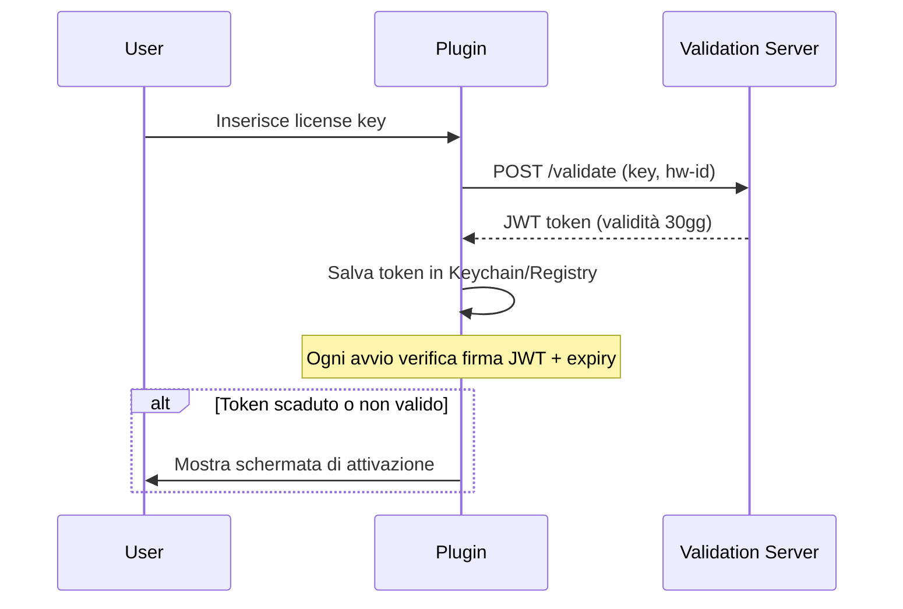

# Paper 12 — Deploy e Distribuzione

*CI/CD, Code Signing, Notarizzazione e Installer*

---

> **Sommario:** Questo paper descrive la pipeline di distribuzione completa di WhyCremisi, dalla build automation alla pubblicazione finale. Copre il versionamento semantico, la compilazione multi-piattaforma, la firma digitale (code signing), la notarizzazione macOS, la creazione di installer e l'automazione tramite GitHub Actions. L'obiettivo è garantire un rilascio sicuro, ripetibile e verificabile su macOS, Windows e Linux.

---

## 1 — Panoramica del Ciclo di Rilascio

WhyCremisi adotta **Semantic Versioning 2.0.0** (`MAJOR.MINOR.PATCH`) con i seguenti criteri:

| Componente | Quando incrementa | Esempio |
|---|---|---|
| **MAJOR** | Breaking change API/plugin | `2.0.0` |
| **MINOR** | Nuova feature, backward-compatibile | `1.3.0` |
| **PATCH** | Bug fix, nessuna nuova feature | `1.2.1` |

Il ciclo di rilascio segue quattro stadi progressivi:

```
Nightly ──→ Beta ──→ RC ──→ Stable
   │            │       │        │
   v            v       v        v
 0.x.y-dev   0.x.y-b  x.y.z-rc  x.y.z
```

```
┌──────────────────────────────────────────────────────────┐
│                    RELEASE CYCLE FLOW                      │
│                                                            │
│  main ─────────────────────────────────────────────────    │
│    │                                                       │
│    ├── develop ───────────────────────────────────────     │
│    │    │                                                  │
│    │    ├── feature/my-feature ───┐                        │
│    │    │                         │                        │
│    │    ├── fix/issue-123 ────────┤  ┌─ nightly ──┐       │
│    │    │                         ├──│  (automatic) │       │
│    │    └── ...                   │  └─────────────┘       │
│    │                              │                        │
│    │                              v                        │
│    │  release/v1.2.0 ──► tag v1.2.0-rc.1                  │
│    │       │                                               │
│    │       ├── rc.2 (se necessario)                        │
│    │       │                                               │
│    │       └── tag v1.2.0 (stable)                         │
│    │               │                                       │
│    │               v                                       │
│    │  hotfix/v1.2.1 ──► tag v1.2.1 (da main)              │
│    │                                                       │
└──────────────────────────────────────────────────────────┘
```

[NOTE] I rami `hotfix/*` partono da `main` e vengono mergiati sia in `main` che in `develop` per evitare regressioni.

---

## 2 — Build Automation

WhyCremisi utilizza **CMake presets** per standardizzare la build su tutti e tre i sistemi operativi.

### 2.1 — CMakePresets.json

```json
{
  "version": 8,
  "configurePresets": [
    {
      "name": "debug",
      "displayName": "Debug",
      "generator": "Ninja",
      "binaryDir": "${sourceDir}/build/debug",
      "cacheVariables": {
        "CMAKE_BUILD_TYPE": "Debug",
        "CMAKE_OSX_ARCHITECTURES": "x86_64;arm64"
      }
    },
    {
      "name": "release",
      "displayName": "Release",
      "generator": "Ninja",
      "binaryDir": "${sourceDir}/build/release",
      "cacheVariables": {
        "CMAKE_BUILD_TYPE": "Release",
        "CMAKE_OSX_ARCHITECTURES": "x86_64;arm64"
      }
    },
    {
      "name": "relwithdebinfo",
      "displayName": "RelWithDebInfo",
      "generator": "Ninja",
      "binaryDir": "${sourceDir}/build/relwithdebinfo",
      "cacheVariables": {
        "CMAKE_BUILD_TYPE": "RelWithDebInfo",
        "CMAKE_OSX_ARCHITECTURES": "x86_64;arm64"
      }
    }
  ],
  "buildPresets": [
    { "name": "debug",    "configurePreset": "debug" },
    { "name": "release",  "configurePreset": "release" },
    { "name": "relwithdebinfo", "configurePreset": "relwithdebinfo" }
  ]
}
```

### 2.2 — Universal Binary (macOS)

`CMAKE_OSX_ARCHITECTURES` è impostato a `x86_64;arm64` per produrre un **universal binary** compatibile con Intel e Apple Silicon. Il comando di build:

```bash
cmake --preset release -G "Xcode" \
  -DCMAKE_OSX_ARCHITECTURES="x86_64;arm64" \
  -DCMAKE_XCODE_ATTRIBUTE_CODE_SIGN_IDENTITY="Developer ID Application: WhyCremisi"
cmake --build --preset release --config Release
```

### 2.3 — Windows

```bash
cmake --preset release -G "Visual Studio 17 2022" -A x64
cmake --build --preset release --config Release
```

Il signing Windows utilizza `signtool.exe` integrato nel post-build step di CMake.

### 2.4 — Linux

```bash
cmake --preset release -G "Ninja"
cmake --build --preset release
cpack -G DEB   # genera .deb
cpack -G RPM   # genera .rpm
```

| Piattaforma | Generatore | Formato pacchetto | Artefatto |
|---|---|---|---|
| macOS | Xcode | .dmg | VST3 + AU + Standalone |
| Windows | Visual Studio 17 2022 | .exe (Inno Setup) | VST3 + AAX + Standalone |
| Linux | Ninja | .deb / .rpm | VST3 + Standalone |

---

## 3 — Code Signing macOS

La firma digitale è obbligatoria per distribuire plugin audio su macOS. WhyCremisi utilizza un certificato **Apple Developer ID Application**.

### 3.1 — Certificato e Profilo

- **Tipo:** Developer ID Application (per distribuzione outside Mac App Store)
- **Autorità:** Apple Worldwide Developer Relations Certification Authority
- **Durata:** 3 anni (rinnovo manuale)

### 3.2 — Entitlements

```xml
<!-- entitlements.plist -->
<?xml version="1.0" encoding="UTF-8"?>
<!DOCTYPE plist PUBLIC "-//Apple//DTD PLIST 1.0//EN"
  "http://www.apple.com/DTDs/PropertyList-1.0.dtd">
<plist version="1.0">
<dict>
  <key>com.apple.security.cs.disable-library-validation</key>
  <true/>
  <key>com.apple.security.cs.allow-unsigned-executable-memory</key>
  <true/>
  <key>com.apple.security.cs.allow-dyld-environment-variables</key>
  <true/>
</dict>
</plist>
```

[NOTE] `com.apple.security.cs.disable-library-validation` è **obbligatoria** per i plugin VST3 che caricano librerie di terze parti a runtime.

### 3.3 — Comando di Firma

```bash
# Firma del bundle VST3
codesign --deep --force --verify --verbose \
  --options runtime \
  --sign "Developer ID Application: WhyCremisi (TEAMID)" \
  --entitlements entitlements.plist \
  WhyCremisi.vst3

# Verifica
codesign --verify --verbose=4 WhyCremisi.vst3
spctl --assess --verbose=4 --type execute WhyCremisi.vst3
```

### 3.4 — Hardened Runtime

L'opzione `--options runtime` abilita **Hardened Runtime**, che applica i seguenti controlli:

- Prevenzione esecuzione codice arbitrario
- Protezione memoria heap
- Controllo accesso a risorse di sistema

---

## 4 — Code Signing Windows

Windows richiede un certificato **Extended Validation (EV) Code Signing** per garantire la massima fiducia.

### 4.1 — Signtool

```bash
signtool sign /fd SHA256 \
  /tr "http://timestamp.digicert.com" \
  /td SHA256 \
  /a \
  /v \
  WhyCremisiInstaller.exe
```

| Parametro | Descrizione |
|---|---|
| `/fd SHA256` | Digest algorithm SHA-256 |
| `/tr <url>` | RFC 3161 timestamp server |
| `/td SHA256` | Timestamp digest algorithm |
| `/a` | Seleziona automaticamente il certificato migliore |

### 4.2 — Windows Hardware Compatibility Program

Per i driver audio (se necessari), WhyCremisi può sottoporsi al **Windows Hardware Compatibility Program (WHCP)** per ottenere una firma Microsoft aggiuntiva che garantisce compatibilità con Driver Signature Enforcement.

### 4.3 — Verifica Firma

```powershell
Get-AuthenticodeSignature -FilePath WhyCremisiInstaller.exe
```

---

## 5 — Notarizzazione macOS

La notarizzazione è il processo con cui Apple verifica che il software sia privo di componenti dannosi.

### 5.1 — Submission con notarytool

```bash
# Creazione del pacchetto zip per la notarizzazione
ditto -c -k --sequesterRsrc --keepParent \
  WhyCremisi.dmg WhyCremisi-notarize.zip

# Invio a notarytool
xcrun notarytool submit \
  --apple-id "developer@whycremisi.com" \
  --team-id "TEAMID" \
  --password "@keychain:AC_PASSWORD" \
  --wait \
  WhyCremisi-notarize.zip
```

### 5.2 — UploadPayload.json

```json
{
  "primaryBundleId": "com.whycremisi.plugin",
  "primaryBundleVersion": "1.2.0",
  "options": {
    "userId": "TEAMID"
  }
}
```

### 5.3 — Waiting Loop

```bash
# Ottenere lo stato della notarizzazione
xcrun notarytool log \
  --apple-id "developer@whycremisi.com" \
  --team-id "TEAMID" \
  --password "@keychain:AC_PASSWORD" \
  <submission-id>
```

### 5.4 — Stapling

```bash
# Staple: attacca il ticket di notarizzazione al DMG
xcrun stapler staple WhyCremisi.dmg

# Verifica
xcrun stapler validate WhyCremisi.dmg
spctl --assess --verbose=4 --type install WhyCremisi.dmg
```

```
┌──────────────┐     ┌──────────────┐     ┌──────────────┐
│   ZIP/Build  │────→│  notarytool  │────→│    Apple     │
│   (firmato)  │     │   submit     │     │  Notary Srv  │
└──────────────┘     └──────────────┘     └──────┬───────┘
                                                 │
                                                 v
┌──────────────┐     ┌──────────────┐     ┌──────────────┐
│  DMG finale  │←────│    stapler   │←────│   Ticket +   │
│  (staple)    │     │    staple    │     │   Log OK     │
└──────────────┘     └──────────────┘     └──────────────┘
```

---

## 6 — Installer

### 6.1 — macOS: DMG

Il DMG di WhyCremisi include:

- **Background personalizzato** (WhyCremisi brand, 660×400 px)
- **Symlink a /Applications** per drag-and-drop
- **EULA** visualizzata all'apertura
- **Component plist** per VST3, AU e Standalone

```bash
# Creazione DMG con create-dmg (tool open-source)
create-dmg \
  --volname "WhyCremisi 1.2.0" \
  --background "installer-bg.png" \
  --window-pos 200 120 \
  --window-size 660 400 \
  --icon-size 100 \
  --icon "WhyCremisi.app" 180 170 \
  --icon "WhyCremisi.vst3" 360 170 \
  --icon "WhyCremisi.component" 540 170 \
  --app-drop-link 400 170 \
  --eula "LICENSE.txt" \
  --no-internet-enable \
  "WhyCremisi-1.2.0.dmg" \
  "dist_output/"
```

**Struttura del DMG:**
```
WhyCremisi-1.2.0.dmg
├── WhyCremisi.app                    (Standalone)
├── WhyCremisi.vst3                   (Plugin VST3)
├── WhyCremisi.component              (Plugin AU)
└── Applications → /Applications      (Symlink)
```

### 6.2 — Windows: Inno Setup

Script Inno Setup per l'installer Windows:

```iss
[Setup]
AppName=WhyCremisi
AppVersion=1.2.0
DefaultDirName={commonpf}\WhyCremisi
DefaultGroupName=WhyCremisi
UninstallDisplayIcon={app}\WhyCremisi.exe
Compression=lzma2
SolidCompression=yes
OutputDir=dist
OutputBaseFilename=WhyCremisi-1.2.0-Setup
SignTool=MySignTool

[Components]
Name: VST3; Description: VST3 Plugin (64-bit); Types: full custom
Name: AAX; Description: AAX Plugin (Pro Tools); Types: full custom
Name: Standalone; Description: Standalone Application; Types: full custom

[Files]
Source: "build\Release\WhyCremisi.vst3"; DestDir: "{commonpf}\Common Files\VST3"; Components: VST3
Source: "build\Release\WhyCremisi.aaxplugin"; DestDir: "{commonpf}\Avid\Audio\Plug-Ins"; Components: AAX
Source: "build\Release\WhyCremisi.exe"; DestDir: "{app}"; Components: Standalone

[Run]
Filename: "{app}\WhyCremisi.exe"; Description: "Launch WhyCremisi"; Flags: postinstall nowait skipifsilent
```

### 6.3 — Linux: .deb / .rpm

```bash
# Debian/Ubuntu
cpack -G DEB
# Genera: WhyCremisi-1.2.0-Linux.deb

# Fedora/RHEL
cpack -G RPM
# Genera: WhyCremisi-1.2.0-Linux.rpm
```

| Piattaforma | Installer | Path VST3 |
|---|---|---|
| macOS | .dmg | `/Library/Audio/Plug-Ins/VST3/` |
| Windows | .exe (Inno Setup) | `%COMMONPROGRAMFILES%\VST3\` |
| Linux | .deb / .rpm | `~/.vst3/` o `/usr/lib/vst3/` |

---

## 7 — Canali di Distribuzione

### 7.1 — Download Diretti

Il sito web (`whycremisi.com/download`) ospita i pacchetti firmati con checksum SHA-256 pubblicato. Ogni release include:

```
WhyCremisi-1.2.0-macOS.dmg
WhyCremisi-1.2.0-Windows-Setup.exe
WhyCremisi-1.2.0-Linux.deb
WhyCremisi-1.2.0-Linux.rpm
WhyCremisi-1.2.0-SHA256SUMS.txt      ← checksum file
WhyCremisi-1.2.0-SHA256SUMS.txt.sig   ← GPG signature
```

### 7.2 — Auto-Update

| Piattaforma | Framework | Formato aggiornamento |
|---|---|---|
| macOS | Sparkle | `.appcast.xml` + DMG firmato |
| Windows | Squirrel | `.nupkg` + Release EXE |

[NOTE] Sparkle fornisce un'appcast XML firmata con chiave EdDSA. La verifica crittografica avviene lato client prima di applicare qualsiasi aggiornamento.

### 7.3 — License Key Validation

WhyCremisi integra un sistema di validazione offline/online:



### 7.4 — Telemetry (Opt-In)

Il crash reporting utilizza **Crashpad (macOS/Windows)** con invio a un endpoint privato. L'utente deve esplicitamente acconsentire durante l'installazione o dal menu impostazioni.

---

## 8 — Release Automation

### 8.1 — GitHub Actions Workflow

```yaml
# .github/workflows/release.yml
name: Release Pipeline

on:
  push:
    tags:
      - 'v*'

jobs:
  build:
    strategy:
      matrix:
        os: [macos-13, windows-2022, ubuntu-22.04]
    runs-on: ${{ matrix.os }}
    steps:
      - uses: actions/checkout@v4
      - uses: actions/setup-python@v5
        with:
          python-version: '3.11'

      - name: Configure CMake
        run: cmake --preset release

      - name: Build
        run: cmake --build --preset release

      - name: Code Sign (macOS)
        if: runner.os == 'macOS'
        run: |
          echo "${{ secrets.MAC_CERTIFICATE }}" | base64 --decode > cert.p12
          security create-keychain -p temp build.keychain
          security import cert.p12 -k build.keychain -P "${{ secrets.MAC_CERT_PASSWORD }}"
          security set-key-partition-list -S apple-tool:,apple: -s -k temp build.keychain
          cmake --build --preset release --target sign

      - name: Notarize (macOS)
        if: runner.os == 'macOS'
        run: |
          xcrun notarytool submit \
            --apple-id "${{ secrets.APPLE_ID }}" \
            --team-id "${{ secrets.TEAM_ID }}" \
            --password "${{ secrets.APPLE_APP_PASSWORD }}" \
            --wait WhyCremisi-notarize.zip
          xcrun stapler staple WhyCremisi.dmg

      - name: Code Sign (Windows)
        if: runner.os == 'Windows'
        run: |
          echo "${{ secrets.WIN_CERTIFICATE }}" | base64 --decode > cert.pfx
          signtool sign /fd SHA256 /tr http://timestamp.digicert.com \
            /td SHA256 /f cert.pfx /p "${{ secrets.WIN_CERT_PASSWORD }}" \
            WhyCremisiInstaller.exe

      - name: Package
        run: cmake --build --preset release --target package

      - name: Upload Release Asset
        uses: softprops/action-gh-release@v2
        with:
          files: dist/*
```

### 8.2 — Changelog Generation

Il changelog è generato automaticamente dai commit convenzionali (`feat:`, `fix:`, `chore:`) tramite `git-cliff`:

```bash
git-cliff --config cliff.toml --tag "v1.2.0" --output CHANGELOG.md
```

### 8.3 — Draft Release PR

Prima di ogni rilascio, un PR di `release/vX.Y.Z` verso `main` attiva:

1. Build di staging su tutti e 3 gli OS
2. Esecuzione della suite di test completa
3. Generazione bozza release notes
4. Approvazione manuale richiesta

---

## 9 — Verifica Post-Rilascio

### 9.1 — Smoke Test Automatizzato

```bash
# Verifica integrità firma (macOS)
codesign --verify --verbose WhyCremisi.vst3
codesign -dvvv WhyCremisi.app

# Verifica notarizzazione (macOS)
spctl --assess --verbose=4 --type install WhyCremisi.dmg

# Verifica checksum
shasum -a 256 -c WhyCremisi-1.2.0-SHA256SUMS.txt

# Verifica firma Windows
signtool verify /pa /v WhyCremisiInstaller.exe
```

### 9.2 — Hash Verification SHA-256

```bash
# Generazione checksum
sha256sum dist/* > SHA256SUMS.txt
gpg --detach-sign --armor SHA256SUMS.txt
```

### 9.3 — Malware Scan

Prima del rilascio finale, ogni build viene scansionata con:

- **VirusTotal API** (60+ engine antivirus)
- **macOS XProtect** check
- **Windows Defender** scan

```bash
curl --request POST \
  --url "https://www.virustotal.com/api/v3/files" \
  --header "x-apikey: $VT_API_KEY" \
  --form "file=@WhyCremisi-1.2.0-macOS.dmg"
```

### 9.4 — DAW Compatibility Smoke Test

| DAW | Piattaforma | Plugin | Carica | Processa | Salva |
|---|---|---|---|---|---|
| Ableton Live 12 | macOS/Windows | VST3 | ✓ | ✓ | ✓ |
| Logic Pro 11 | macOS | AU | ✓ | ✓ | ✓ |
| Pro Tools 2024 | macOS/Windows | AAX | ✓ | ✓ | ✓ |
| FL Studio 21 | Windows | VST3 | ✓ | ✓ | ✓ |
| Cubase 13 | macOS/Windows | VST3 | ✓ | ✓ | ✓ |
| REAPER 7 | macOS/Windows/Linux | VST3 | ✓ | ✓ | ✓ |
| Studio One 6 | macOS/Windows | VST3 | ✓ | ✓ | ✓ |

---

## Riferimenti

| Risorsa | URL |
|---|---|
| CMake Presets | https://cmake.org/cmake/help/latest/manual/cmake-presets.7.html |
| Apple Code Signing | https://developer.apple.com/documentation/security/code_signing |
| Apple NotaryTool | https://developer.apple.com/documentation/notarytool |
| Sparkle Framework | https://sparkle-project.org |
| Squirrel.Windows | https://github.com/Squirrel/Squirrel.Windows |
| Inno Setup | https://jrsoftware.org/isinfo.php |
| git-cliff | https://git-cliff.readthedocs.io |
| VirusTotal API | https://developers.virustotal.com |
| JUCE Audio Plugin | https://juce.com |
